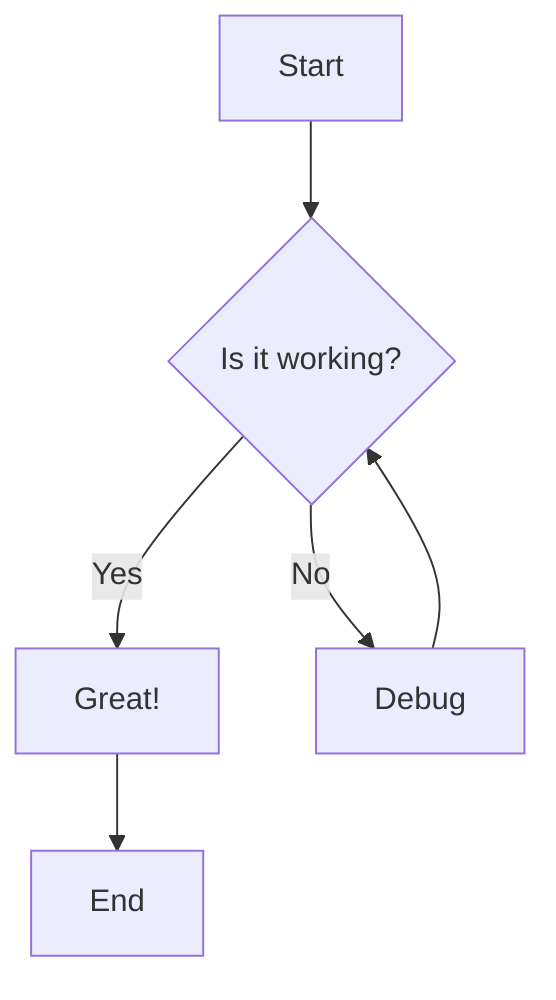
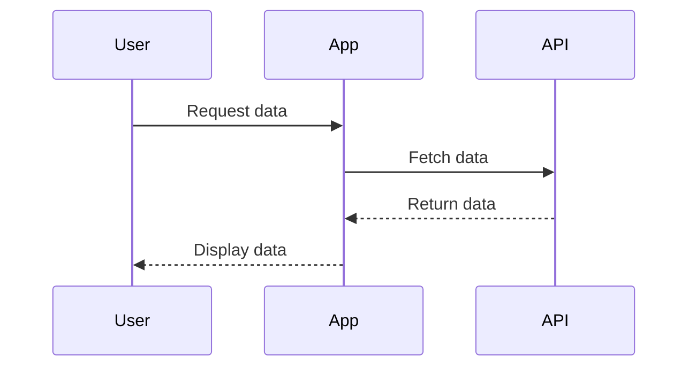

# 📊 Mermaid Diagram Editor

A powerful, real-time Mermaid diagram editor with live preview and high-quality export capabilities. Create beautiful diagrams with instant feedback and export them in multiple formats.

  

## ✨ Features

### 🎨 **Real-time Editing**
- **Live Preview**: See your diagrams render as you type
- **Monaco Editor**: Full-featured code editor with syntax highlighting
- **Mermaid Syntax Support**: Custom language support for Mermaid diagrams
- **Error Detection**: Real-time validation with helpful error messages

### 📊 **Diagram Types Supported**
- **Flowcharts** (`flowchart`, `graph`)
- **Sequence Diagrams** (`sequenceDiagram`)
- **Class Diagrams** (`classDiagram`)
- **State Diagrams** (`stateDiagram`)
- **Gantt Charts** (`gantt`)
- **Pie Charts** (`pie`)
- **User Journey** (`journey`)
- **Git Graphs** (`gitgraph`)
- **Requirements** (`requirement`)
- **Mindmaps** (`mindmap`)
- **Timelines** (`timeline`)
- **ER Diagrams** (`erDiagram`)

### 🎯 **Export Options**
- **Multiple Formats**: PNG, SVG, PDF
- **Quality Presets**: Low (800x600) to Ultra (4K)
- **Custom Scaling**: 0.5x to 3x zoom levels
- **Theme Support**: Default, Dark, Forest, Neutral
- **Batch Export**: Export multiple formats simultaneously

### 🎨 **User Interface**
- **Split View**: Editor and preview side by side
- **Fullscreen Preview**: Distraction-free diagram viewing
- **Zoom Controls**: Pan and zoom for detailed inspection
- **Theme Switching**: Multiple Mermaid themes
- **Responsive Design**: Works on desktop and mobile

### 🚀 **Performance**
- **Debounced Validation**: Efficient API calls while typing
- **Temporary File Management**: Automatic cleanup of generated files
- **Error Recovery**: Graceful handling of syntax errors
- **Background Processing**: Non-blocking diagram generation

## 🛠️ Installation

### Prerequisites
- **Node.js** 16+ 
- **npm** or **yarn**
- **Git**

### Quick Start

1. **Clone the repository**
   ```bash
   git clone https://github.com/yourusername/mermaid-diagram-editor.git
   cd mermaid-diagram-editor
   ```

2. **Install dependencies**
   ```bash
   npm run install-all
   ```

3. **Start development servers**
   ```bash
   npm run dev
   ```

4. **Open in browser**
   - Frontend: http://localhost:3002
   - Backend API: http://localhost:3001

### Manual Installation

If the automated installation fails:

```bash
# Install root dependencies
npm install

# Install backend dependencies
cd backend
npm install

# Install frontend dependencies
cd ../frontend
npm install
```

## 🎮 Usage

### Basic Usage

1. **Start Editing**: Type your Mermaid code in the left editor panel
2. **Live Preview**: Watch your diagram render in real-time on the right
3. **Export**: Click the export button to download in your preferred format

### Example Diagrams

**Flowchart:**


**Sequence Diagram:**


### Export Options

- **Format**: PNG (default), SVG, PDF
- **Quality**: 
  - Low (800x600) - Web preview
  - Medium (1200x800) - Standard quality
  - High (1920x1080) - Presentation quality
  - Ultra (4K) - Print quality
- **Theme**: Default, Dark, Forest, Neutral
- **Scale**: Custom zoom level (0.5x to 3x)

## 🏗️ Architecture

### Backend (Node.js/Express)
- **API Routes**: RESTful endpoints for validation, rendering, and export
- **Mermaid Service**: Core diagram processing using @mermaid-js/mermaid-cli
- **Export Service**: High-quality image generation with multiple formats
- **File Management**: Temporary file handling with automatic cleanup

### Frontend (React)
- **Monaco Editor**: Advanced code editor with Mermaid syntax highlighting
- **Real-time Preview**: Live diagram rendering with zoom and theme controls
- **Export Interface**: Intuitive export dialog with quality presets
- **Responsive Design**: Mobile-friendly interface

### Key Components
```
├── Backend (Port 3001)
│   ├── /api/diagram/* - Validation and rendering
│   ├── /api/export/* - Export and download
│   └── Static file serving
├── Frontend (Port 3002)
│   ├── Monaco Editor - Code editing
│   ├── Preview Panel - Live rendering
│   └── Export Controls - Download interface
```

## 📡 API Reference

### Diagram Validation
```http
POST /api/diagram/validate
Content-Type: application/json

{
  "code": "flowchart TD\n  A --> B"
}
```

### Diagram Rendering
```http
POST /api/diagram/render
Content-Type: application/json

{
  "code": "flowchart TD\n  A --> B",
  "options": {
    "format": "svg",
    "theme": "default",
    "width": 1200,
    "height": 800
  }
}
```

### Export Download
```http
POST /api/export/download
Content-Type: application/json

{
  "code": "flowchart TD\n  A --> B",
  "options": {
    "format": "png",
    "quality": "high",
    "theme": "default",
    "filename": "my-diagram"
  }
}
```

## 🔧 Configuration

### Environment Variables

Create a `.env` file in the backend directory:

```env
# Server Configuration
PORT=3001
NODE_ENV=development

# File Handling
MAX_FILE_SIZE=10mb
TEMP_DIR=./temp

# Mermaid Defaults
DEFAULT_THEME=default
DEFAULT_WIDTH=1200
DEFAULT_HEIGHT=800
```

### Frontend Configuration

Update `webpack.config.js` for different environments:

```javascript
// Development
devServer: {
  port: 3002,
  proxy: {
    '/api': 'http://localhost:3001'
  }
}

// Production
output: {
  publicPath: '/mermaid-editor/'
}
```

## 🚀 Deployment

### Production Build

```bash
# Build frontend
cd frontend
npm run build

# Start production server
cd ../backend
NODE_ENV=production node server.js
```

### Docker Deployment

```dockerfile
FROM node:18-alpine
WORKDIR /app
COPY package*.json ./
RUN npm install
COPY . .
RUN cd frontend && npm run build
EXPOSE 3001
CMD ["node", "backend/server.js"]
```

### Environment Setup

```bash
# Build and run with Docker
docker build -t mermaid-editor .
docker run -p 3001:3001 -e NODE_ENV=production mermaid-editor
```

## 🤝 Contributing

1. **Fork the repository**
2. **Create a feature branch**: `git checkout -b feature/amazing-feature`
3. **Commit changes**: `git commit -m 'Add amazing feature'`
4. **Push to branch**: `git push origin feature/amazing-feature`
5. **Open a Pull Request**

### Development Guidelines

- Follow ESLint configuration
- Add tests for new features
- Update documentation
- Use conventional commit messages

## 🐛 Troubleshooting

### Common Issues

**Preview not showing:**
- Check browser console for errors
- Verify backend is running on port 3001
- Ensure mermaid-cli is installed: `npm list @mermaid-js/mermaid-cli`

**Export not working:**
- Check file permissions for temp directory
- Verify Puppeteer can launch browser
- Check available disk space

**Slow rendering:**
- Reduce diagram complexity
- Use lower quality settings
- Check system memory usage

### Debug Mode

Enable detailed logging:

```bash
DEBUG=mermaid:* npm run dev
```

## 📄 License

This project is licensed under the MIT License - see the [LICENSE](LICENSE) file for details.

## 🙏 Acknowledgments

- [Mermaid.js](https://mermaid-js.github.io/) - Diagram syntax and rendering
- [Monaco Editor](https://microsoft.github.io/monaco-editor/) - Code editor
- [React](https://reactjs.org/) - Frontend framework
- [Express](https://expressjs.com/) - Backend framework

## 📊 Project Stats

- **Languages**: JavaScript, HTML, CSS
- **Frameworks**: React, Express, Node.js
- **Dependencies**: Monaco Editor, Mermaid CLI, Puppeteer
- **Supported Formats**: PNG, SVG, PDF
- **Browser Support**: Chrome, Firefox, Safari, Edge

## 🔗 Links

- **Live Demo**: [Demo Link](your-demo-url)
- **Documentation**: [Full Docs](./documentation-v2.md)
- **Issues**: [GitHub Issues](https://github.com/yourusername/mermaid-diagram-editor/issues)
- **Discussions**: [GitHub Discussions](https://github.com/yourusername/mermaid-diagram-editor/discussions)

---

**Made with ❤️ for the developer community**

*If you find this project helpful, please consider giving it a ⭐ star on GitHub!*
